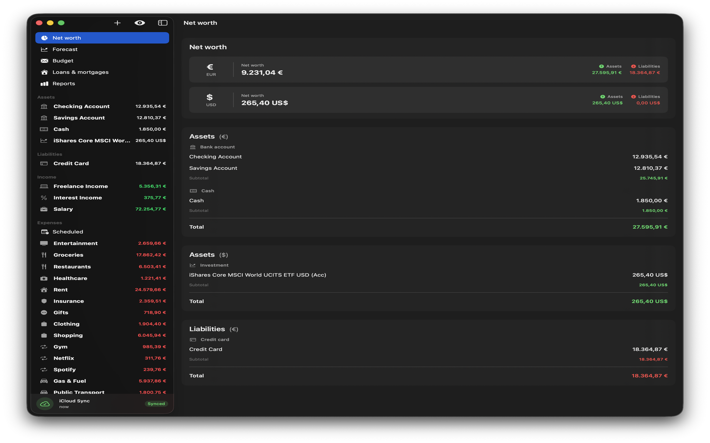

# Cash - Personal Finance Manager

A simplified macOS financial management application inspired by Gnucash, built with SwiftUI and SwiftData.

## Screenshots



## Getting Started

### Prerequisites
- macOS 14.0 or later
- Xcode 15.0 or later
- Swift 5.9 or later

### Installation

1. Clone the repository:
```bash
git clone https://github.com/yourusername/cash.git
cd cash
```

2. Open the project in Xcode:
```bash
open Cash.xcodeproj
```

3. Build and run the project (⌘R)

## Build Configuration

### iCloud Sync (Optional)

iCloud sync is disabled by default. To enable it:

1. In Xcode, select the **Cash** target
2. Go to **Build Settings** → **Swift Compiler - Custom Flags**
3. Add `ENABLE_ICLOUD` to **Active Compilation Conditions** for the desired configuration (Debug/Release)

Or via command line:
```bash
xcodebuild -scheme Cash -configuration Release \
  SWIFT_ACTIVE_COMPILATION_CONDITIONS='$(inherited) ENABLE_ICLOUD' \
  build
```

**Requirements for iCloud:**
- Apple Developer account with CloudKit enabled
- Configure the iCloud container identifier in `Cash.entitlements`
- Sign the app with a valid provisioning profile
- Ensure the `ENABLE_ICLOUD` build flag is set for the desired configuration (Debug/Release) if required by your setup

## Development

### Resetting the Data Store

If you need to reset the application data (e.g., after schema changes during development), delete the SwiftData store:

```bash
rm -rf ~/Library/Application\ Support/Cash
rm -rf ~/Library/Containers/com.thesmokinator.Cash/Data/Library/Application\ Support/Cash
```

Then restart the application. The setup wizard will appear to create new default accounts.

## Localization

Cash is fully localized in:
- 🇬🇧 English
- 🇮🇹 Italian
- 🇪🇸 Spanish
- 🇫🇷 French
- 🇩🇪 German

Language can be changed on-the-fly in Settings without restarting the app.

To add a new language, edit `Localizable.xcstrings` in Xcode.

## Data Persistence

All data is stored locally using SwiftData. When iCloud sync is enabled (build flag + user preference), data syncs across devices via CloudKit.

## Contributing

We welcome contributions! Please read our [Contributing Guidelines](CONTRIBUTING.md) and [Code of Conduct](CODE_OF_CONDUCT.md) before submitting a Pull Request.

## License

This project is licensed under the MIT License - see the LICENSE file for details.
